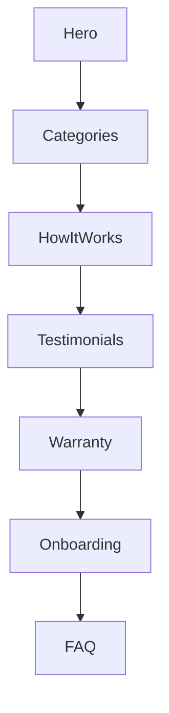

# FixIt Branding & Visual Identity System

> **Context:** Align FixIt’s branding across landing pages, admin controls, and mobile/web surfaces for a service-focused marketplace pairing customers with trusted providers and servicemen.

## 1. Brand Foundations (Current)

| Element | Current State | Notes |
| --- | --- | --- |
| Logo | SVG with wrench icon + wordmark | Limited monochrome variant |
| Colors | Primary blue `#1F5ED6`, accent green `#00B894`, warning gold `#FFC845` | Lacks tonal ramp for backgrounds |
| Typography | Web uses `Inter`, mobile `SF Pro` | No fallback documented |
| Buttons | Solid primary, ghost secondary | Minimal focus styling |
| Cards | Light shadow, rounded corners | Inconsistent padding |
| Landing Hero | Static hero with single CTA | No variant per persona |

```
+------------------------------+
|  FixIt: Trusted Service Pros |
|  [Book Now]                  |
+------------------------------+
```

## 2. Brand Enhancements (After Upgrades)

### 2.1 Color System

* **Core Palette:**
  * `Service Blue` `#1846A3`
  * `Provider Green` `#00A37A`
  * `Warranty Gold` `#F6B83D`
  * `Support Coral` `#FF6F61`
  * `Infrastructure Slate` `#1F2937`
* **Neutrals:** `#0F172A`, `#1E293B`, `#334155`, `#475569`, `#64748B`, `#94A3B8`, `#CBD5F5`, `#E2E8F0`, `#F8FAFC`
* **Usage Matrix:**

| Palette | Landing | Dashboard | Mobile |
| --- | --- | --- | --- |
| Service Blue | Hero gradients, CTA buttons | Headers, icons | App bar, status bar |
| Provider Green | Provider KPIs, success toasts | Crew availability | Checklist success |
| Warranty Gold | Warranty locker background | Renewal alerts | Warranty cards |
| Support Coral | Escalation alerts | Incident lane | Push notifications |

### 2.2 Typography System

* **Primary Typeface:** `Inter` (web), `InterVariable` (mobile via Google Fonts).
* **Fallbacks:** `"Segoe UI", "Roboto", "Helvetica Neue", Arial, sans-serif`.
* **Headings:** Uppercase tracking for admin metrics; use `font-variation-settings: "wght" 650`.
* **Body:** 16px base, responsive `clamp(1rem, 0.95rem + 0.2vw, 1.125rem)`.
* **Special:** Warranty certificates use `"Source Serif Pro"` for trust cues.

### 2.3 Buttons & Controls

* Variants: Primary (filled), Secondary (outline), Tertiary (ghost), Destructive (red), Neutral (surface).
* States defined via tokens: `--fx-btn-shadow-rest`, `--fx-btn-shadow-pressed`.
* Icon buttons use `24px` glyphs, accessible labels.

```
[Primary ▸ Dispatch Crew]
[Secondary ▢ Save Draft]
[Ghost    ○ Preview]
```

### 2.4 Cards & Layout Modules

* **Service Cards:** Gradient header with provider logo, rating badge, CTA.
* **Crew Cards:** Map snippet, serviceman avatar stack, status chip.
* **Warranty Cards:** Folded-corner motif, QR code for claim scanning.
* **Metrics Tiles:** Glassmorphism overlay for admin hero metrics.

### 2.5 Landing Page Architecture

1. **Hero:**
   * Dynamic background (video or animated illustration of servicemen).
   * Primary CTA “Book a trusted crew” + secondary “Become a provider”.
   * Badges: “24/7 Dispatch”, “Warranty-backed services”.
2. **Service Categories Carousel:** Plumbing, Electrical, HVAC, Cleaning, Custom Projects.
3. **How It Works:** 4-step timeline (Request → Match Providers → Dispatch Servicemen → Warranty Follow-up).
4. **Testimonials:** Provider-focused, serviceman highlight with photo.
5. **Warranty Promise:** Card stack showing coverage tiers.
6. **Provider & Serviceman Onboarding:** Dual CTA + comparison grid.
7. **FAQ & Support:** Expandable accordion, support contact CTAs.



### 2.6 Admin Branding Console

* **Logo Manager:** Upload + cropping, assign logos per provider, set default fallback.
* **Color Kit Editor:** Pick from palette or custom; auto-check contrast.
* **Font Selector:** Choose heading/body fonts, link to Google Fonts or custom uploads.
* **Card Layout Builder:** Drag modules (service card, warranty badge, trust strip).
* **Preview Modes:** Desktop, tablet, mobile toggles.
* **Versioning:** Save drafts, publish, revert.

### 2.7 Mobile Branding

* Splash screen gradient uses Service Blue → Provider Green.
* App icon variants for provider vs serviceman (toolbelt overlay).
* In-app theming derived from server-driven config; offline fallback stored in secure storage.

## 3. Imagery & Illustration

* Commission illustrations showing crews arriving, servicemen with branded uniforms.
* Photography guidelines: warm lighting, real homes, crews in FixIt gear.
* Iconography: Outline style with rounded corners, consistent stroke 2px.

## 4. Copy & Tone

* **Voice:** Confident, service-first, supportive.
* **Taglines:** “Dispatch-ready crews in minutes.”, “Warranty-backed workmanship.”
* **Microcopy:** Buttons reference actions (“Dispatch Crew”), not generic (“Submit”).

## 5. Governance & QA

* Maintain `docs/brand/brand-book.pdf` with exports.
* Enforce via linting: Stylelint for color tokens, Flutter CI for theme coverage.
* Admin approvals required for logo or palette changes; log to `brand_audit` table.

## 6. Rollout Schedule

1. Week 1: Palette + typography tokens ready.
2. Week 2: Landing rebuild with new modules.
3. Week 3: Admin branding console + provider onboarding assets.
4. Week 4: Mobile splash/app icon update.

---

> Simple sketches and flow above act as quick references for the reimagined brand story.
