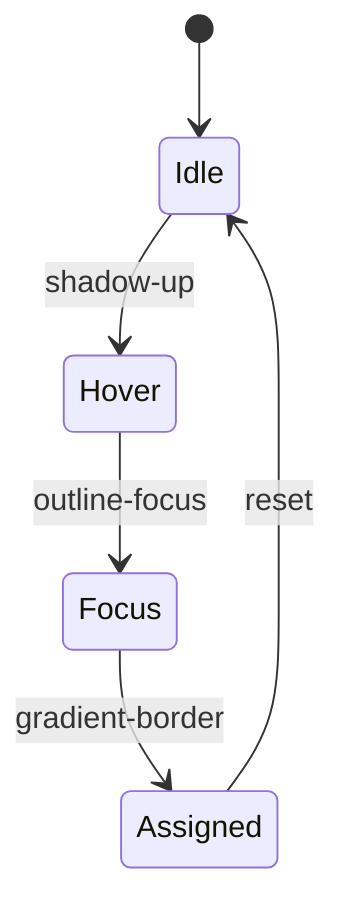

# FixIt CSS & UI Styling Guide

> **Audience:** Web (Laravel + Vite) and Flutter mobile squads delivering FixIt as a service-first marketplace connecting customers, providers, and servicemen.

## 1. Current Experience Audit

### 1.1 Web Application

| Layer | Tokens & Variables | Components | Responsiveness | Notes |
| --- | --- | --- | --- | --- |
| Foundations | `$brand-primary`, `$brand-secondary`, `$accent-warm`, `$neutral-100..900` mapped to SCSS variables | Tailwind utility overrides for buttons, tags, availability chips | Breakpoints: `xs 360`, `sm 600`, `md 768`, `lg 1024`, `xl 1280` | Palette slightly inconsistent between crew dispatch screens and provider catalog editor |
| Layout | Flex grid with `clamp()` for cards | Header, service request timeline, provider roster grid | Auto-flow columns with `minmax(18rem, 1fr)` | Needs denser spacing for warranty callouts |
| Interactions | Primary buttons use `box-shadow: 0 8px 16px rgba(31, 94, 214, 0.24)` | Buttons, segmented controls, service badges | Hover/focus states rely on color only | Add icons for accessibility |

```
+----------------------+
|  Dispatch Dashboard  |
| [Crew Card] [Crew Card]
| [Crew Card] [Crew Card]
| Warranty Alerts Banner|
+----------------------+
```

### 1.2 Mobile Application (Flutter)

| Layer | Tokens | Widgets | Motion | Notes |
| --- | --- | --- | --- | --- |
| Foundations | `Color(0xFF1F5ED6)` primary, `Color(0xFF00B894)` success, `Color(0xFFFFC845)` warning | `ElevatedButton`, `Card`, `Chip` | Implicit animations via `AnimatedContainer` | Dark mode incomplete for provider availability toggles |
| Layout | `SliverAppBar` + `CustomScrollView` | Job feed tile, provider toolkit card, serviceman assignment list | `Hero` transitions between feed and job detail | Need tactile feedback on warranty toggles |

```
 ________________
| Job Feed       |
| • Plumbing Fix |
| • HVAC Tune-up |
| • Roof Repair  |
|________________|
```

## 2. Upgrade Vision

### 2.1 Shared Design Tokens

* Convert palette into CSS variables + Flutter `ThemeExtension`:
  * `--fx-surface-100` to `--fx-surface-900`
  * `--fx-service-blue`, `--fx-provider-green`, `--fx-warranty-gold`
* Typography scale (web CSS custom properties + Flutter `TextTheme`):

```
Scale (rem)   Usage
1.75          Dashboard headings
1.5           Section titles
1.25          Card headings
1.0           Body
0.875         Metadata
```

* Shadows harmonized:
  * Level 1: `0 1px 2px rgba(17, 24, 39, 0.08)`
  * Level 2: `0 12px 24px rgba(17, 24, 39, 0.12)`
* Border radius tokens: `--fx-radius-sm: 6px`, `--fx-radius-md: 12px`, `--fx-radius-lg: 20px`.

### 2.2 Web Components

* **Service Deck Layout**: CSS Grid `grid-template-columns: repeat(auto-fill, minmax(22rem, 1fr))` with `gap: clamp(1rem, 2vw, 1.75rem)`.
* **Action Buttons**: Primary, Secondary, Subtle, Destructive variants with `:focus-visible` outlines at `3px` accent.
* **Crew Avatar Stack**: Use `mask-image: radial-gradient(...)` for overlapping servicemen icons; animate assignment state.
* **Warranty Tag**: `background: linear-gradient(135deg, var(--fx-warranty-gold), #FFEDD5);`.
* **CSS Motion**: prefer `transform` transitions for provider card expansion; use `prefers-reduced-motion` query fallback.



### 2.3 Mobile Widgets

* Migrate to `ThemeData(colorScheme: ColorScheme.fromSeed(seedColor: fxServiceBlue))`.
* Build `FxServiceBadge`, `FxWarrantyChip`, `FxCrewTimeline` with Lottie micro-animations.
* Adaptive layout via `LayoutBuilder` for tablets; portrait splits job details + crew chat.
* Provide `Cupertino` theming for iOS parity.

```
┌────────────────────────┐
│ Admin Job Summary      │
│ ┌───────┬────────────┐ │
│ │Crew   │Service Pack│ │
│ └───────┴────────────┘ │
│ Warranty ✓   ETA 35m   │
└────────────────────────┘
```

## 3. Accessibility & Compliance

* WCAG 2.2 AA contrast >= 4.5:1 for text on primary backgrounds.
* `prefers-color-scheme` support with auto theme toggle in admin panel.
* Use CSS logical properties for RTL readiness.
* Provide Flutter `Semantics` labels referencing provider or serviceman roles.

## 4. Implementation Checklist

1. Create `resources/css/tokens.css` and `resources/css/components/buttons.css`.
2. Update Vue/Blade partials to map new tokens in `resources/js/components`.
3. Ship Flutter `fx_theme.dart` with matching enums.
4. Add Storybook/Widgetbook stories for all states (default, hover, focus, disabled, busy).
5. Document fallback fonts for offline kiosk setups.

## 5. QA Visual Regression Scripts

* BackstopJS viewports: 360, 768, 1024, 1440.
* Appium screenshot diff for Android/iOS key screens.
* Compare provider roster gradient across dark/light mode.

## 6. Rollout Plan

* Week 1: Tokens + theming scaffolding.
* Week 2: Core components + regression testing.
* Week 3: Mobile release candidate with toggled feature flag `ui.theming.v2`.

---

> Sketches above double as quick visual anchors for crew-heavy dispatch scenarios.
