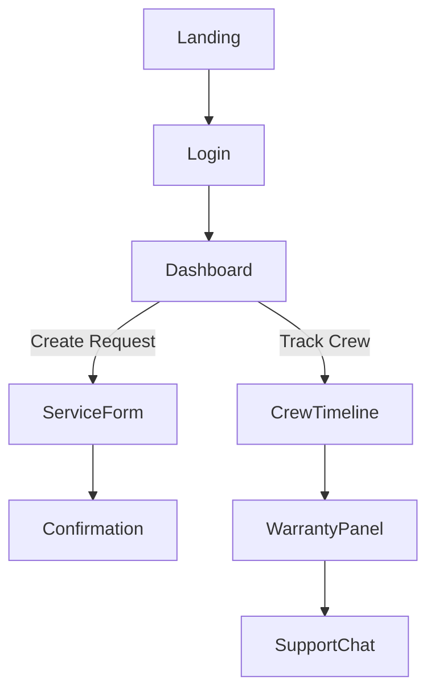
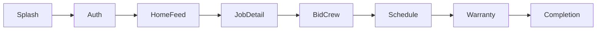
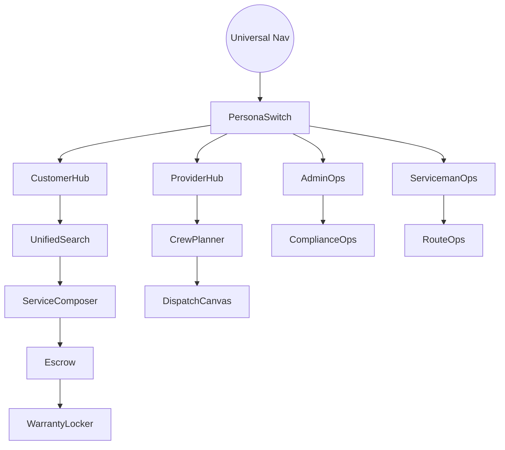
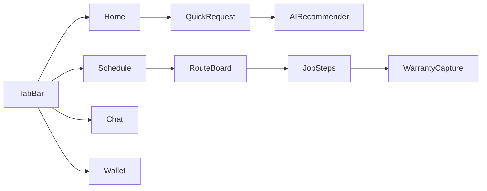

# FixIt CSS & UX Flow Blueprint

> **Objective:** Map end-to-end experience organization for both web and phone apps, capturing current flows and post-upgrade orchestration for customers, providers, and servicemen.

## 1. Current Flow Mapping

### 1.1 Web User Journeys



* **Navigation Shell:** Left rail (dashboard, live jobs, crew directory, invoices) + top bar (search, notifications, profile).
* **Customer Dashboard:** Shows `Active Services`, `Upcoming Visits`, `Warranty Status` tables.
* **Provider Dashboard:** `Open Requests`, `Crew Availability`, `Inventory` tabs.
* **Admin Panel:** `Dispatch Board`, `Escrow`, `Compliance` cards, but settings nested.

### 1.2 Mobile Journeys



* **Customer Home Feed:** Scrolling cards for local services, emergency toggles.
* **Provider Home:** Shift planner, service packages, earnings snapshot.
* **Serviceman App:** Quick accept queue, map view, job checklist.

## 2. UX Pain Points

| Persona | Web | Mobile |
| --- | --- | --- |
| Customer | Warranty renewals buried in settings; dispatch timeline lacks filtering. | Hard to find warranty documents; offline mode missing. |
| Provider | Crew availability calendar uses modal layering; cannot bulk update service packages. | Limited analytics on completions vs cancellations. |
| Serviceman | Route optimization hidden in admin; job checklist static. | Limited tactile feedback on job steps; no quick reassign. |

```
+-------------+      +----------------+
| Pain Point  | ---> | Opportunity    |
+-------------+      +----------------+
```

## 3. Upgrade UX Flow

### 3.1 Web Application



* **Universal Navigation:** Sticky top nav with segmented persona switch for admins managing both providers and servicemen.
* **Customer Hub:** Tile layout `Service Requests`, `Upcoming Visits`, `Warranty Locker`, `Invoices`, `Support`.
* **Provider Hub:** `Crew Planner` (drag-and-drop), `Service Packages`, `Quality Metrics`, `Financials`.
* **Serviceman Ops:** `Route Ops` map with clustering, `Job Checklist` progressive accordion.
* **Admin Ops:** `Compliance Ops`, `Escrow`, `Incident Desk` quick actions.
* **Settings Drawer:** Right side panel with collapsible categories: `Profile`, `Locations`, `Service Coverage`, `Branding`, `Automation`, `Security`.

### 3.2 Mobile Application



* **Customer Tabs:** Home, Schedule, Warranty, Support.
* **Provider Tabs:** Dispatch, Packages, Crew, Finance.
* **Serviceman Tabs:** Queue, Route, Checklist, Profile.
* **Overlay Sheets:** Quick request creator with slider for urgency; provider package editor with tiered pricing.
* **Gestures:** Swipe left to reassign crew, long press to add warranty note.

### 3.3 Settings Architecture

| Category | Web Structure | Mobile Structure | Notes |
| --- | --- | --- | --- |
| Account | Inline tabs (Profile, Notifications, Security) | Scroll sections with sticky CTA | Security MFA prompts for providers |
| Services | Accordion (Packages, Pricing, Availability) | Stepper for quick edits | Connects to provider marketing cards |
| Branding | Live preview panel | Carousel preview on mobile | Shares tokens from design guide |
| Compliance | Table with filters | Card deck with status chips | Tracks serviceman certifications |
| Automation | Rule builder (IF job type -> THEN assign crew) | Flowchart with toggles | Supports warranty extension logic |

## 4. Interaction Patterns

* **Guided Tours:** Use `driver.js` for web and Flutter `showCaseView` for mobile to highlight new flows.
* **Task Completion Badges:** Animated progress ring for providers hitting SLA, servicemen finishing jobs on time.
* **Contextual Help:** Inline info buttons referencing service packages, crew roles.
* **Microcopy:** Reinforce service-first messaging, e.g., “Dispatch a certified serviceman” vs “Hire freelancer”.

## 5. Accessibility & Performance

* Logical heading hierarchy, consistent skip links.
* Mobile leverages `ScrollablePositionedList` for accessible focus states.
* Prefetch crew avatars and service package icons using responsive images / `precachedNetworkImage`.
* Provide offline caching for job checklists and warranties.

## 6. Implementation Milestones

1. Build persona switch in shared layout.
2. Implement settings drawer/drawer sheets with full coverage.
3. Update web router to align with new hub structure.
4. Update mobile navigation to segmented tab sets with guard rails per role.
5. QA end-to-end for each persona with feature flag `ux.flow.v2`.

---

> Hand-sketched diagrams above illustrate the directional flow for improved crew coordination.
