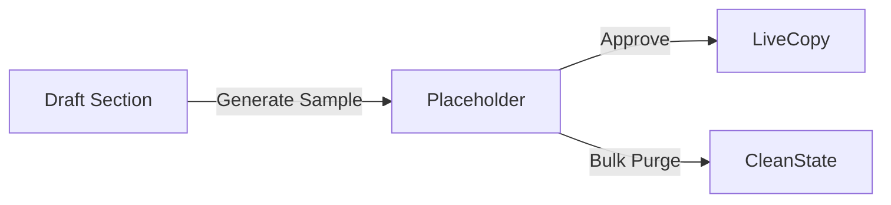

# FixIt Dummy Content & Data Controls Guide

> **Purpose:** Provide robust handling of placeholder copy, imagery, and demo data across FixIt web and mobile applications so teams can stage service experiences for customers, providers, and servicemen without leaking to production.

## 1. Current State Assessment

| Area | Current Behavior | Risk |
| --- | --- | --- |
| Landing CMS | Defaults to lorem ipsum for new sections | Published placeholders reduce trust |
| Provider Packages | Starter templates with generic bullet points | Providers forget to update, confusing servicemen |
| Warranty Docs | Placeholder PDF references outdated policy | Compliance issues |
| Mobile Notifications | Dummy push text reused in prod builds | Customer confusion |

```
Placeholder Flow Today:
Draft Section --> Lorem Ipsum --> Manual Replace --> Publish
```

## 2. Upgrade Objectives

1. Centralize dummy content tokens per domain (`landing`, `packages`, `warranties`, `notifications`).
2. Give admins and providers tooling to generate, review, purge, and report on placeholders.
3. Sync dummy content state to Firebase Remote Config for mobile gating.
4. Provide audit trail when placeholders ship to staging or prod.

## 3. Web Admin Controls

### 3.1 Dummy Content Studio

* Located under Admin → Branding → Dummy Content.
* Panels for `Landing`, `Provider Packages`, `Warranty Docs`, `Notifications`.
* Controls:
  * `Generate Sample` (uses service-type aware prompts).
  * `Insert Placeholder` (marks section with badge `Placeholder Active`).
  * `Replace with Approved Copy` (clear badge, track revision).
  * `Bulk Purge` with confirmation + optional schedule.
* Visualization:



### 3.2 Monitoring & Alerts

* Dashboard widget: count of placeholders per page + SLA timer.
* Email/slack alerts when placeholder older than 3 days in staging or 1 day in production.
* Export CSV of outstanding placeholders for content teams.

### 3.3 Permissions

| Role | Capabilities |
| --- | --- |
| Admin | Full CRUD, schedule purges, export reports |
| Provider | Generate/replace within own brand kits |
| Serviceman Lead | View only (to confirm accurate job briefs) |

## 4. Mobile Controls (Flutter)

* **Remote Config Keys:**
  * `dummy.landing.enabled`
  * `dummy.packages.enabled`
  * `dummy.warranty.enabled`
  * `dummy.notifications.enabled`
* **In-App Badge:** Show “Placeholder” ribbon on cards when dummy flag true.
* **Provider App:** Quick action “Request Copywriting” to notify admin when placeholder persists.
* **Offline Handling:** Cache placeholder status locally with TTL to avoid stale states.

```
┌────────────────────────┐
│ Placeholder Warning     │
│ Replace package copy?   │
│ [Request Support] [Edit]│
└────────────────────────┘
```

## 5. Data Model & Storage

| Table | Fields | Notes |
| --- | --- | --- |
| `dummy_tokens` | `id`, `domain`, `content`, `locale`, `status`, `created_by`, `expires_at` | Tracks placeholder lifecycle |
| `dummy_audits` | `id`, `token_id`, `action`, `actor_id`, `environment`, `timestamp` | Records purges, approvals |
| `firebase_configs` | `id`, `key`, `value`, `env`, `synced_at` | Mirror remote config pushes |

* Add `placeholder_badge` boolean to `pages` and `packages` tables for quick detection.

## 6. Workflow Integration

1. When admin creates new landing section → auto-generate placeholder with expiry 72h.
2. Content team receives task via integration (e.g., Linear) with link to edit.
3. Provider receives notification if their service packages still use placeholder after expiry.
4. Serviceman lead sees banner in job brief if placeholder remains; can flag for removal.
5. Deployment guard fails CI if any production page has `placeholder_badge = true`.

## 7. Reporting & Analytics

* Monthly report summarizing placeholder usage, time-to-replace, domain trends.
* Dashboard heatmap showing pages with most placeholders.
* Track conversion impact when dummy copy replaced with approved copy.

## 8. Security & Compliance

* Ensure placeholder generator never stores customer PII; use synthetic addresses.
* Restrict purge actions to admin accounts with MFA.
* Audit log accessible for compliance review.

## 9. Rollout Plan

1. Build `dummy_tokens` CRUD API + admin UI.
2. Integrate Firebase Remote Config sync job.
3. Update mobile apps to respect placeholder flags.
4. Configure alerts + CI gate.
5. Train providers and servicemen using interactive guides.

---

> Diagrams and sketches above illustrate how placeholders flow from creation to approval across service teams.
